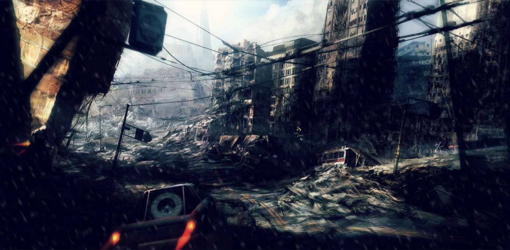

# TO DO BEFORE MVP
<b>[Programming]</b> Functional Health UI:  Areeb  
<b>[Programming]</b> Settings w/ more options & completed:  Taher   
<b>[Programming]</b> Scaling fix  
<b>[Programming]</b> Floor 4 (Puzzle 7):  Bhaven (Areeb)  
<strike><b>[Programming]</b> Dialogue </strike>
<b>[Programming]</b> Inventory:  Vivian 
<b>[Programming]</b> NPCs:  Nisha  
<b>[Programming]</b> Unit testing:  not needed for the MVP 

<b>[Development]</b> <strike> Project Website:  Kunal ---> NEEDS TO PUSH THE WEBPAGE ON GITHUB  </strike>

<b>[Design]</b> Floor 1:  Jacob (only if we need)  
<b>[Design]</b> Floor 2:  Becca (areeb)  
<b>[Design]</b> NPCs/Chax and Main Characters:  Zeth  
<b>[Design]</b> Objects / Weapons for player to find/use:  Vivian  

<b>[Sound]</b> Music/FX for each floor & actions:  
<b>[Sound]</b> Voice actors:  Avni & Jacob & Kunal  

<b>[General]</b> Separate script for voice actors to read off:  Avni, Jacob & Kunal  
<b>[General]</b> Sprite change, because the characters are "too cute for a horror game" smh:  Zeth 

# FinalDeadline

Placeholder :/

# Aston University

Placeholder :/

## Team 2

KUNAL AGARWALA  
TAHER AHMED  
REBECCA BARRETT  
NISHA KHATRI  
VIVIAN KNIGHT  
AREEB MOHAMMAD  
ZETH OSHARODE  
BHAVEN PATEL  
AVNI SOLANKI  
JACOB WILLIAMS  

### Screenshots

